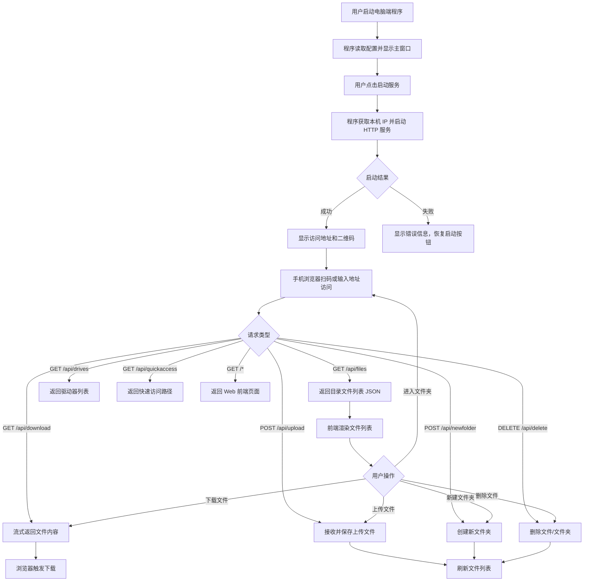

# 局域网文件传输工具 - 产品需求文档 (PRD)

## 1. 产品概述
一款基于 .NET 的局域网文件传输工具，电脑端运行服务后，手机通过浏览器访问并仿 Windows 资源管理器界面浏览、上传和下载文件。
- **核心价值**：解决手机与电脑之间在局域网内快速传输文件的痛点，无需安装额外 APP
- **目标用户**：需要在多设备间频繁传输文件的用户

## 2. 核心功能

### 2.1 用户角色
| 角色 | 使用方式 | 核心权限 |
|------|---------|---------|
| 服务端用户 | 运行 .NET WinForms 程序 | 启动/停止服务、查看日志、配置端口/IP/自启动、查看二维码 |
| 客户端用户 | 手机浏览器访问 | 浏览文件、下载文件、上传文件、新建文件夹、删除文件 |

### 2.2 功能模块
1. **服务端控制台**（MainForm）：显示服务状态、本机 IP、访问地址、日志输出区域、系统托盘图标
2. **设置窗体**（FormSettings）：端口配置、固定 IP 绑定、开机自启动、访问二维码显示
3. **Web 文件管理器**：仿 Windows 11 资源管理器的响应式 Web 界面（侧边栏导航 + 面包屑 + 工具栏 + 内容区）

### 2.3 页面详情
| 页面名称 | 模块名称 | 功能描述 |
|-----------|---------|---------|
| 服务端窗口 | 控制面板 | 显示本机可用 IP、端口、启动/停止按钮、访问地址 |
| 服务端窗口 | 日志区 | 彩色日志输出（INFO/WARN/ERROR），自动滚动，深色背景 |
| 服务端窗口 | 系统托盘 | 最小化到托盘，右键菜单退出/重启服务 |
| 设置窗体 | 网络配置 | 端口号设置、固定 IP 选择（支持自动检测本机 IP） |
| 设置窗体 | 启动选项 | 开机自启动开关 |
| 设置窗体 | 二维码 | 生成访问地址二维码，便于手机扫码访问 |
| Web 主页 | 侧边栏导航 | 快速访问：桌面、文档、下载、图片等常用目录；驱动器列表 |
| Web 主页 | 地址栏 | 面包屑导航 + 后退/前进/上级按钮 |
| Web 主页 | 工具栏 | 新建文件夹、上传、删除、排序方式切换、视图模式切换（图标/列表） |
| Web 主页 | 内容区 | 文件/文件夹列表展示，支持点击进入文件夹、多选、批量操作 |
| Web 主页 | 状态栏 | 当前路径、选中项数量、存储空间信息 |

## 3. 核心流程

## 4. 用户界面设计

### 4.1 设计风格 - 仿 Windows 11 资源管理器
- **主色调**：Mica 半透明背景效果（#F3F3F3 基础色），强调色 #0078D4（Windows 蓝）
- **侧边栏**：左侧固定宽度 220px，深色背景 #F9F9F9，带图标+文字导航项
- **工具栏**：顶部固定，包含地址栏、视图切换、排序按钮
- **内容区**：网格或列表布局，文件图标 + 名称 + 大小 + 修改时间
- **字体**：Segoe UI Variable（系统默认），中文用微软雅黑作为 fallback
- **圆角**：卡片 8px，按钮 6px，输入框 4px
- **阴影**：轻微阴影 `0 2px 8px rgba(0,0,0,0.08)`

### 4.2 页面设计概览
| 页面名称 | 模块名称 | UI 元素 |
|-----------|---------|---------|
| 服务端窗口 | 信息卡 | IP 地址大字显示、端口、状态指示灯（绿/红） |
| 服务端窗口 | 日志区 | 深色背景 Consolas 字体，彩色日志输出，自动滚动 |
| 设置窗体 | 网络配置 | 端口 NumericUpDown、固定 IP 下拉框（自动检测本机 IP） |
| 设置窗体 | 二维码区 | PictureBox 显示访问地址二维码 |
| Web 首页 | 侧边栏 | 此电脑、桌面、文档、下载、图片、视频、音乐，可展开的驱动器列表 |
| Web 首页 | 地址栏 | 面包屑导航 + 后退/前进/上级按钮 |
| Web 首页 | 文件列表 | 图标视图（网格）和详细信息视图（表格）两种模式切换 |
| Web 首页 | 上传区 | 点击选择文件按钮，支持多文件上传 |

### 4.3 响应式设计
- **桌面优先**（≥1024px）：完整三栏布局（侧边栏 + 主内容）
- **平板适配**（768-1023px）：侧边栏可收起为图标模式
- **手机优化**（<768px）：侧边栏隐藏为抽屉式菜单，单列文件列表，触摸友好的点击区域（min 44px）
- **触摸优化**：长按触发选择模式，底部浮动操作栏

## 5. 技术约束
- 后端使用 .NET 10.0 (net10.0-windows) + WinForms
- HTTP 服务器使用 ASP.NET Core 内置 Kestrel
- 前端为纯静态文件（HTML/CSS/JS），嵌入到后端项目中作为 EmbeddedResource
- 无需数据库，直接操作文件系统
- 支持大文件传输（流式上传/下载）
- 配置持久化使用 JSON 文件（webexplorer.settings.json）
- 路径安全：规范化路径 + 路径穿越段检查，防止目录遍历攻击
