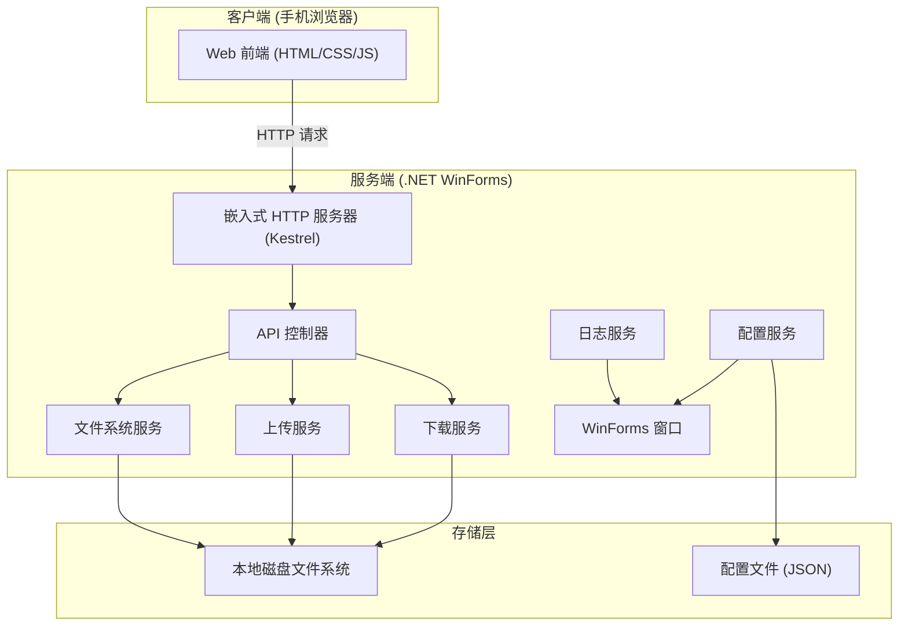
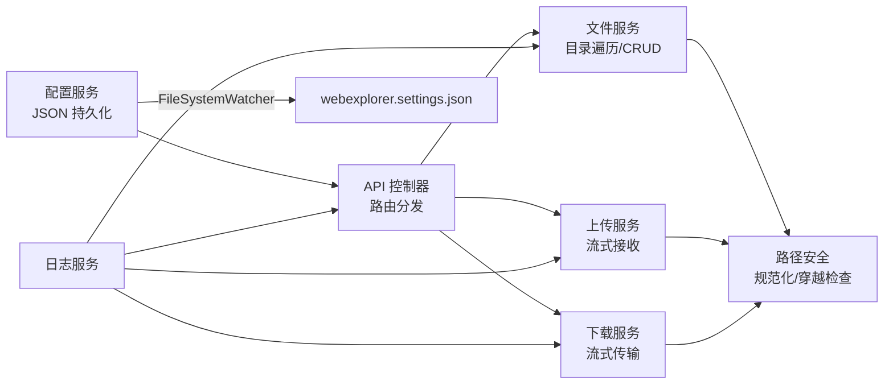

# 局域网文件传输工具 - 技术架构文档

## 1. 架构设计



## 2. 技术选型

### 后端技术栈

* **框架**：.NET 10.0 (net10.0-windows)

* **UI 框架**：WinForms（用于服务端控制台窗口与设置窗体）

* **HTTP 服务器**：Kestrel（ASP.NET Core 内置，通过 `WebApplication.CreateBuilder` 启动）

* **依赖注入**：Microsoft.Extensions.DependencyInjection（ASP.NET Core 内置）

* **日志**：自定义 `LogService`，通过 `Control.Invoke` 安全跨线程更新 WinForms TextBox，彩色输出（INFO=绿色，WARN=黄色，ERROR=红色）

* **静态文件**：以 `EmbeddedResource` 方式打包前端文件，通过 `ManifestEmbeddedFileProvider` 提供服务

* **二维码**：QRCoder 库（NuGet 包，版本 1.8.0）

### 前端技术栈

* **基础**：纯 HTML5 + CSS3 + Vanilla JavaScript（无构建工具，保持轻量）

* **样式**：CSS Variables + Flexbox/Grid 布局

* **图标**：SVG 内联图标（Fluent UI 风格）

* **交互**：原生 Fetch API，支持拖拽上传

### 开发工具

* **IDE**：Visual Studio 2022 / VS Code

* **包管理**：NuGet

* **版本控制**：Git

## 3. 路由定义

| 路由                 | 方法     | 用途        | 说明                                   |
| ------------------ | ------ | --------- | ------------------------------------ |
| `/`                | GET    | 返回主页面     | SPA 入口                               |
| `/api/files`       | GET    | 获取目录内容    | Query: ?path=C:\Users                |
| `/api/download`    | GET    | 下载文件      | Query: ?path=C:\file.txt             |
| `/api/upload`      | POST   | 上传文件      | FormData: file + targetPath          |
| `/api/delete`      | DELETE | 删除文件/文件夹  | Body: { path: string }               |
| `/api/newfolder`   | POST   | 创建新文件夹    | Body: { path: string, name: string } |
| `/api/drives`      | GET    | 获取所有驱动器列表 | 返回 C:, D: 等信息                        |
| `/api/quickaccess` | GET    | 获取快速访问路径  | 返回桌面、文档等特殊目录                         |
| `/static/*`        | GET    | 静态资源      | JS/CSS/图标等                           |

## 4. API 定义

### 4.1 获取目录内容

```typescript
// GET /api/files?path=C:\Users\Documents
interface FileItem {
  name: string;           // 文件名
  fullPath: string;       // 完整路径
  isDirectory: boolean;   // 是否为目录
  size: number;           // 字节大小（目录为0）
  lastModified: string;   // ISO 8601 时间戳
  extension: string;      // 扩展名（无扩展名为空字符串）
}

interface DirectoryResponse {
  path: string;            // 当前路径
  parentPath: string|null; // 父级路径（根目录为null）
  items: FileItem[];       // 文件/文件夹列表
  totalSize: number;       // 当前目录总大小
}
```

### 4.2 上传文件

```typescript
// POST /api/upload
// Content-Type: multipart/form-data
// Fields: file (File), targetPath (string)

interface UploadResponse {
  success: boolean;
  message: string;
  filePath: string;
}
```

### 4.3 获取驱动器信息

```typescript
// GET /api/drives
interface DriveInfoModel {
  letter: string;          // 盘符如 "C:"
  label: string;           // 卷标如 "系统"
  totalSpace: number;      // 总空间字节
  freeSpace: number;       // 可用空间字节
  usedSpace: number;       // 已用空间字节
  driveType: number;       // 驱动器类型
}
```

### 4.4 获取快速访问路径

```typescript
// GET /api/quickaccess
interface QuickAccessItem {
  name: string;            // 显示名称如 "桌面"
  path: string;            // 实际路径
  icon: string;            // 图标标识
}
```

### 4.5 统一响应格式

```typescript
interface ApiResponse<T> {
  success: boolean;
  message: string;
  data: T | null;
}
```

## 5. 服务端架构图



## 6. 项目结构

```
WebExplorer/
├── WebExplorer.slnx              # 解决方案文件
├── documents/                    # 项目文档
│   ├── prd.md                    # 产品需求文档
│   └── tech-architecture.md      # 技术架构文档
├── wwwroot/                      # 前端静态文件（嵌入资源）
│   ├── index.html                # 主页面
│   ├── css/
│   │   └── style.css             # 样式文件（仿 Win11 资源管理器）
│   └── js/
│       └── app.js                # 主应用逻辑（文件管理、上传、下载、导航）
└── WebExplorer/                  # 后端项目
    ├── WebExplorer.csproj        # 项目文件（net10.0-windows, WinExe）
    ├── Program.cs                # 程序入口
    ├── MainForm.cs               # 主窗体（服务控制台、托盘图标）
    ├── MainForm.Designer.cs      # 主窗体设计器代码
    ├── FormSettings.cs           # 设置窗体（端口/IP/自启动/二维码）
    ├── FormSettings.Designer.cs  # 设置窗体设计器代码
    ├── Models/
    │   └── FileModels.cs         # 数据模型（FileItem, DirectoryResponse 等）
    ├── Services/
    │   ├── HttpServerService.cs  # HTTP 服务器管理（Kestrel 启停、地址获取）
    │   ├── FileService.cs        # 文件操作服务（目录遍历、CRUD、快速访问）
    │   ├── UploadService.cs      # 上传处理服务（FormData 接收、重名处理）
    │   ├── DownloadService.cs    # 下载处理服务（流式传输、Content-Disposition）
    │   ├── SettingsService.cs    # 配置服务（JSON 持久化、热更新、IP 检测）
    │   └── LogService.cs         # 日志服务（彩色输出、跨线程 UI 更新）
    ├── Controllers/
    │   └── FileApiController.cs  # 文件 API 控制器（路由分发、路径解码）
    └── Utils/
        ├── PathSecurity.cs       # 路径安全验证（规范化、穿越检查）
        ├── MimeTypes.cs          # MIME 类型映射
        └── QRCodeGenerator.cs    # 二维码生成工具
```

## 7. 关键技术实现要点

### 7.1 嵌入式 HTTP 服务器

使用 ASP.NET Core 的 `WebApplication.CreateBuilder` 启动 Kestrel：

* 监听指定端口（默认 8080），绑定 `IPAddress.Any`（0.0.0.0）支持局域网访问
* 配置 Kestrel 限制：`MaxRequestBodySize = long.MaxValue`（允许大文件上传）、`KeepAliveTimeout = 10min`、`RequestHeadersTimeout = 2min`
* 启用 CORS 允许局域网访问
* 静态文件通过 `ManifestEmbeddedFileProvider` 从嵌入资源提供
* 启动失败检测：`RunAppAsync` 异步运行，`StartAsync` 在 500ms 后检查 `_runTask.IsFaulted` 判断是否启动成功（如端口被占用），失败时清理资源并抛出异常通知调用方

### 7.2 路径安全

`PathSecurity` 工具类提供多层防护：

* **规范化**：所有路径经 `Path.GetFullPath` 规范化，解析 `..` 和 `.` 段
* **穿越检查**：`HasTraversalSegments` 拆分路径段，检查是否残留 `..` 或 `.` 段（防御性冗余检查，`GetFullPath` 已会消除）
* **存在性验证**：`IsValidPath` 额外检查路径是否存在
* **根目录约束**：`IsPathUnderRoot` 检查路径是否在允许的根目录下

### 7.3 大文件传输

* **下载**：使用 `FileStream` + `FileResult` 流式传输，`Content-Disposition` 头采用 RFC 5987 格式（`filename` + `filename*=UTF-8''...`）支持中文文件名
* **上传**：通过 `IFormFile` 接收 FormData，`FileShare.None` 独占写入；文件重名时自动追加时间戳后缀

### 7.4 日志输出到 WinForms

* 自定义 `LogService`，通过 `Control.Invoke` 安全跨线程更新 TextBox
* 彩色日志：INFO=绿色，WARN=黄色，ERROR=红色
* 自动滚动到底部

### 7.5 配置持久化与热更新

* `SettingsService` 使用 JSON 文件（`webexplorer.settings.json`）持久化配置
* `FileSystemWatcher` 监听配置文件变更，外部修改后自动重新加载
* 时间戳去抑制：Save 写入后 500ms 内的 watcher 回调视为自身触发，跳过避免重复加载
* `OnSettingsChanged` 事件通知订阅者（MainForm）刷新 UI

### 7.6 前端嵌入方案

* `wwwroot` 目录下文件通过 `<EmbeddedResource Include="..\wwwroot\**\*" />` 打包为嵌入资源
* 启动时通过 `ManifestEmbeddedFileProvider` 从程序集内提供静态文件
* 使用 catch-all 路由 `MapFallback` 处理 SPA 前端路由

### 7.7 系统集成

* **系统托盘**：`NotifyIcon` 实现最小化到托盘，右键菜单支持退出/重启服务
* **开机自启动**：通过注册表 `HKCU\Software\Microsoft\Windows\CurrentVersion\Run` 实现
* **二维码**：QRCoder 库生成访问地址二维码，便于手机扫码访问
